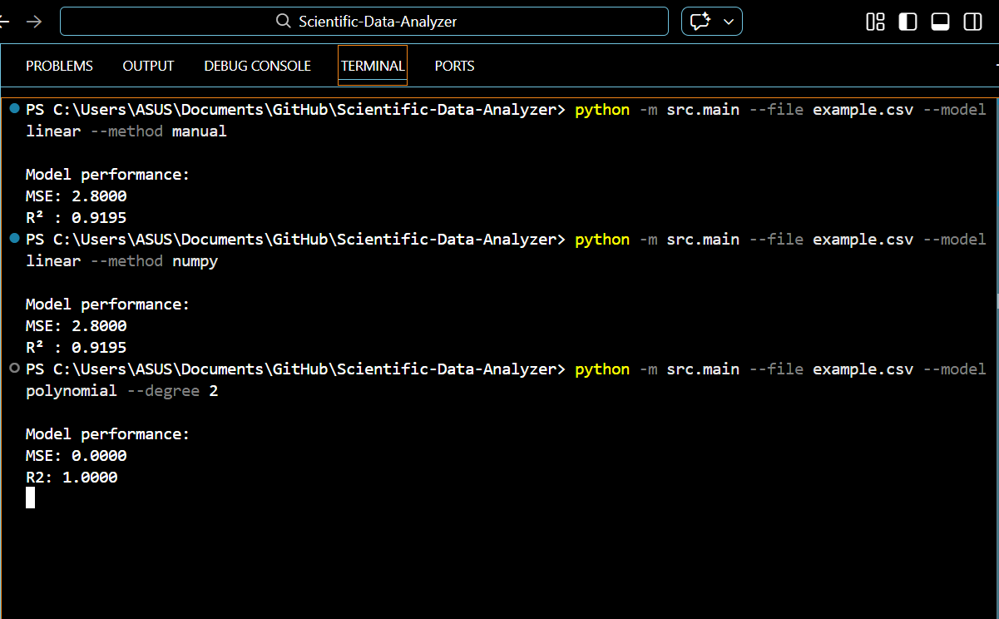

# Scientific Data Analyzer

This project implements a reproducible workflow for quantitative analysis of experimental datasets using regression techniques.

The program reads numerical data from CSV files, fits analytical models to the observations, evaluates the goodness of fit, and visualizes the results.  
Two independent implementations of linear regression are provided: an analytical least-squares solution and a numerical polynomial fitting routine. Their agreement is used to validate the correctness of the model implementation.

The software demonstrates fundamental steps commonly encountered in scientific data analysis:

- data loading and validation
- model fitting
- statistical evaluation of fit quality
- graphical inspection of results
- automated testing of numerical routines


---

## Features

* Load numerical data from CSV files
* Perform **Linear Regression**

  * NumPy implementation
  * Manual implementation (Normal Equation)
* Perform **Polynomial Regression**
* Compute model performance metrics

  * Mean Squared Error (MSE)
  * Coefficient of Determination (R²)
* Plot raw data and fitted models
* Unit tests for analysis and data loading modules

## Verification Methodology

To validate the regression module, two independent implementations of linear regression were compared:

1. **Manual method (Normal Equation)**  
θ = (XᵀX)⁻¹ Xᵀy  
Derived directly from least-squares theory and used as a reference solution.

2. **NumPy method (`numpy.polyfit`)**  
Uses optimized numerical routines for stability and performance.

For the same dataset, both methods produce nearly identical slope and intercept values, confirming correctness of the implementation.

Model performance is additionally evaluated using:
- Mean Squared Error (MSE)
- Coefficient of Determination (R²)

The manual model validates mathematical correctness, while the NumPy model represents practical scientific usage.

---

## Project Structure

```
Scientific-Data-Analyzer/
│
├── src/
│   ├── data_loader.py      # CSV loading utility
│   ├── analysis.py         # Regression algorithms & evaluation
│   └── main.py             # Command line interface
│
├── tests/
│   ├── test_analysis.py    # Regression tests
│   └── test_loader.py      # CSV loader tests
│
├── example.csv             # Example dataset
├── requirements.txt
└── README.md
```

---

## Installation

Clone the repository:

```
git clone <repository-url>
cd Scientific-Data-Analyzer
```

Install dependencies:

```
pip install -r requirements.txt
```

---

## Usage

### Linear regression (NumPy)

```
python -m src.main --file example.csv --model linear --method numpy
```

### Linear regression (Manual implementation)

```
python -m src.main --file example.csv --model linear --method manual
```

### Polynomial regression

```
python -m src.main --file example.csv --model polynomial --degree 2
```

---

## Output

The program will:

1. Load the dataset
2. Fit the selected model
3. Display model performance:

```
Model performance:
MSE: <value>
R² : <value>
```

4. Display a graph containing data points and fitted curve

---

## Screenshots

### Linear Regression (Manual Method)


---

### Linear Regression (NumPy Method)


---

### Polynomial Regression


---

### Model Performance Metrics




---


## Model Evaluation

The program evaluates the quality of the fit using:

* **Mean Squared Error (MSE)**
  Measures the average squared difference between predictions and true values.

* **R² Score**
  Measures how well the model explains variance in the data (1 = perfect fit).

---

## Manual vs NumPy Linear Regression

Both implementations produce the same mathematical result:

| Method | Description                                   |
| ------ | --------------------------------------------- |
| Manual | Uses Normal Equation: θ = (XᵀX)⁻¹Xᵀy          |
| NumPy  | Uses `numpy.polyfit` optimized implementation |

Conclusion:
The manual implementation validates the mathematical correctness, while NumPy provides better numerical stability and performance.

---

## Running Tests

Run all unit tests:

```
python -m unittest discover tests
```

Expected output:

```
....
----------------------------------------------------------------------
Ran tests in X.XXXs

OK
```

---

## Code Design Principles

* Modular structure (separation of CLI, analysis, and I/O)
* Clear documentation and comments
* Reproducible results
* Automated testing
* Readable and maintainable code

---

## Author

Aakarshan Khatiwoda — Software and computing for applied physics

---

## License

This project is for educational purposes.
